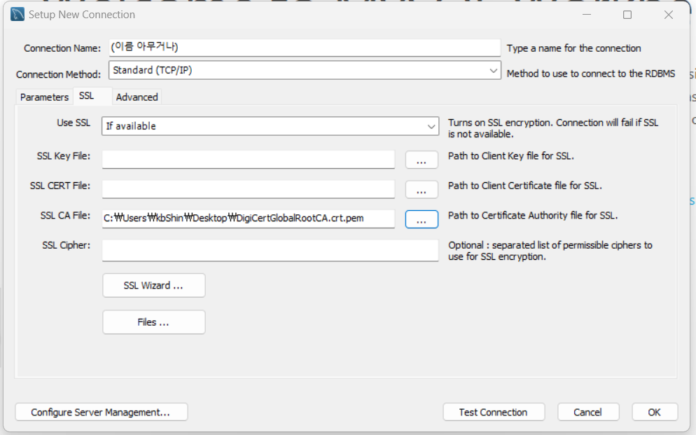

# 데이터베이스 접속 방법

## 배경

**Azure Database for MySQL**에서는 **MySQL** 데이터베이스를 사용. 여기서는 Azure 서버에 설치된 데이터베이스에 원격으로 접속하는 방법을 설명한다.

## 접속 방법

1. **MySQL** 설치
블로그 글(https://velog.io/@joajoa/MySQL-다운로드-및-설치-방법)을 참조하여 MySQL을 설치해주자.  
정확히는 설치하는 프로그램 중 **MySQL Workbench**만 있으면 원격 데이터베이스에 접속할 수 있다. 하지만 원격 데이터베이스는 배포되는 서비스에 적용되므로 로컬 환경에도 설치해주도록하자.  

2. **MySQL Workbench** 실행  
  
  
3. 첫 페이지에서 "+" 버튼 클릭  
  

4. 연결 파라미터 탭(parameter) 입력  
  

    - **Connection Name**: 연결 이름. 원하는 별명 아무거나.
    - **Hostname**: 접속 주소. "projectbeacon-db.mysql.database.azure.com"로 입력.
    - **Username**: MySQL 사용자 이름. "captain"로 입력.
    - **Password**의 **Store in Vault..**:  
      
    "(비밀번호)" 입력.
5. 연결 ssl 탭 입력  
  
**SSL CA File**란에 비밀키 파일의 경로를 입력한다.  
6. 하단의 **Test Connection**을 클릭하여 접속이 정상적으로 되는지 확인  
접속이 되지 않는다면 팀장에게 연락 바랍니다.
